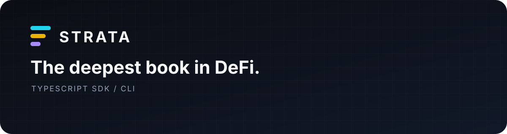

<p align="center">
  
</p>

<h1 align="center">Strata SDK for TypeScript</h1>

<p align="center">
  The official TypeScript client for live Strata markets and Sonar quotes.
</p>

<p align="center">
  <a href="https://stratabook.org/docs/agent-sdks">Documentation</a>
  ·
  <a href="https://github.com/alsk1992/strata-mcp">MCP</a>
  ·
  <a href="https://github.com/alsk1992/strata-sdk-rs">Rust</a>
  ·
  <a href="https://stratabook.app">Strata</a>
</p>

Use `@stratabook/sdk` to discover what is trading, request a Sonar quote, or
bring the same workflow into a terminal. It runs in Node.js 20+ and modern
browsers with no runtime dependencies.

## Start with a live quote

```sh
npm install @stratabook/sdk
```

```ts
import { StrataClient } from "@stratabook/sdk";

const strata = new StrataClient();

const quote = await strata.quote({
  market: "SOL/USDC",
  side: "sell",
  amountInAtoms: 10_000_000n,
  slippageBps: 50,
});

console.log({
  provider: quote.provider,
  output: quote.amount_out_atoms,
  minimumOutput: quote.minimum_output_atoms,
  fee: quote.output_fee_atoms,
  priceImpact: quote.price_impact_pct,
  expiresAt: new Date(quote.expires_at_ms),
});
```

Sonar is Strata's unified liquidity and matching system. The SDK gives it one
market, side, amount, and tolerance; Sonar returns one decision-ready economic
result for the whole Strata market.

## Why build with it

| | |
| --- | --- |
| **One Sonar result** | Quote the whole available Strata market through one stable interface. |
| **Exact economics** | Amounts stay exact from request to response—no floating-point money. |
| **Decision-ready quotes** | Output, fees, minimum output, price impact, and expiry arrive together. |
| **Everywhere TypeScript runs** | Use the same client in Node.js, modern browsers, scripts, and agents. |
| **Terminal included** | Move from application code to shell automation without learning another model. |

## Core workflows

### Discover live markets

```ts
const { markets } = await strata.markets();

const ready = markets
  .filter((market) => market.ready)
  .map((market) => ({
    market: market.label,
    baseDecimals: market.base_decimals,
    quoteDecimals: market.quote_decimals,
  }));

console.table(ready);
```

### Inspect current capabilities

```ts
const { capabilities } = await strata.capabilities();

for (const capability of capabilities) {
  if (capability.default_enabled) {
    console.log(capability.id);
  }
}
```

### Take the same flow to a terminal

```sh
npx -y @stratabook/sdk markets

npx -y @stratabook/sdk quote \
  --market SOL/USDC \
  --side sell \
  --amount-atoms 10000000 \
  --slippage-bps 50
```

Add `--json` when another program or agent will consume the result:

```sh
npx -y @stratabook/sdk quote \
  --market SOL/USDC \
  --side sell \
  --amount-atoms 10000000 \
  --json
```

## Read a Sonar quote

| Field | What you can decide from it |
| --- | --- |
| `amount_in_consumed_atoms` | How much input the quote expects to use |
| `amount_out_atoms` | The quoted output |
| `minimum_output_atoms` | The output floor at your chosen slippage |
| `input_fee_atoms` | Fee charged in the input token |
| `output_fee_atoms` | Fee charged in the output token |
| `reference_price` | The public reference price used for context |
| `price_impact_pct` | Estimated price impact |
| `expires_at_ms` | When to stop using the quote and request a fresh one |

Token values are unsigned decimal strings in atomic units. Pass
`amountInAtoms` as a `bigint` or decimal string; the SDK keeps every returned
amount as a string so precision is never silently lost.

## Choose your Strata interface

| You are building… | Start here |
| --- | --- |
| A TypeScript application or browser experience | This SDK |
| A shell script or terminal workflow | The included `strata` CLI |
| An AI agent that should call Strata directly | [Strata MCP](https://github.com/alsk1992/strata-mcp) |
| A native service or Rust tool | [Strata SDK for Rust](https://github.com/alsk1992/strata-sdk-rs) |
| Better Strata judgment inside a coding agent | [Strata Agent Skills](https://github.com/alsk1992/strata-agent-skills) |

## Configuration

Production is the default:

```ts
const strata = new StrataClient();
```

Set a timeout or a controlled development endpoint when needed:

```ts
const strata = new StrataClient({
  apiBase: "https://api.stratabook.app",
  timeoutMs: 10_000,
});
```

`StrataApiError` includes an HTTP status, stable error code, and retryability
hint. `StrataContractError` means the requested operation or returned data is
not compatible with the SDK's supported contract.

## Current release

`0.1.x` covers market discovery and read-only Sonar quotes. It does not prepare,
sign, or submit transactions and never needs wallet or private-key material.

## Resources

- [Agent quick start](https://stratabook.org/docs/hello-agents)
- [SDK documentation](https://stratabook.org/docs/agent-sdks)
- [Issues and feature requests](https://github.com/alsk1992/strata-sdk-ts/issues)
- [Security policy](SECURITY.md)

Licensed under either [Apache-2.0](LICENSE-APACHE) or [MIT](LICENSE-MIT).
